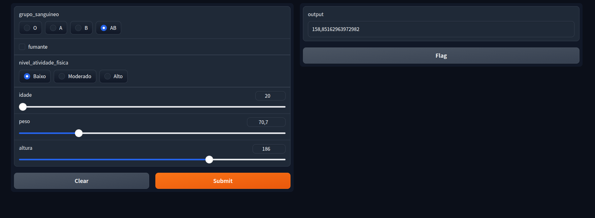

# 🩸 CholestAI — Predição de Colesterol com Regressão Linear Múltipla

**CholestAI** é um modelo de *Machine Learning supervisionado* desenvolvido para prever o **nível de colesterol total** de um paciente com base em características pessoais como idade, peso, altura, grupo sanguíneo, nível de atividade física e hábito de fumar.

O projeto utiliza **Regressão Linear Múltipla** para identificar a influência dessas variáveis nos níveis de colesterol, oferecendo uma previsão rápida e explicativa — útil em contextos laboratoriais ou acadêmicos.

> **Observação:** O dataset utilizado é **fictício**, criado para fins de teste e demonstração do modelo, e não representa dados de pacientes reais.

---

## 🚀 Tecnologias Utilizadas

- **Python 3.8+**
- **Pandas**
- **Scikit-Learn**
- **Joblib**
- **Gradio** — interface interativa para o modelo
- **SciPy** e **Statsmodels** — testes estatísticos

---

## 🛠️ Processos Utilizados

O desenvolvimento do projeto **CholestAI** seguiu as etapas abaixo:

1. **Importação dos dados**  
   Carregamento do dataset fictício de pacientes com informações como idade, peso, altura, grupo sanguíneo, nível de atividade física e hábito de fumar.

2. **EDA (Exploratory Data Analysis)**  
   - Visualização de distribuição de variáveis  
   - Análise de valores nulos  
   - Transformação e codificação de variáveis categóricas

3. **Treinamento do modelo**  
   - Modelo de **Regressão Linear Múltipla**  
   - Pré-processamento com `Pipeline` e `ColumnTransformer`  
   - Tratamento de variáveis numéricas (`StandardScaler`) e categóricas (`OneHotEncoder`, `OrdinalEncoder`)  
   - Preenchimento de valores ausentes com `SimpleImputer`  
   - Divisão treino/teste com `train_test_split`

4. **Análise de métricas**  
   - **R² Score** (`r2_score`)  
   - **Erro Médio Absoluto (MAE)** (`mean_absolute_error`)  
   - **Erro Quadrático Médio (MSE)** (`mean_squared_error`)

5. **Análise de resíduos**  
   Testes para verificar a qualidade da regressão e homocedasticidade:  
   - Testes de normalidade: **Shapiro-Wilk**, **Kolmogorov-Smirnov (KS Test)**, **Anderson-Darling**  
   - Teste de heterocedasticidade: **Goldfeld-Quandt**  
   - Teste de Lilliefors (`lilliefors`)

6. **Realização de predições**  
   - Predição do colesterol para novos pacientes usando o modelo treinado  
   - Transformações aplicadas automaticamente com o `Pipeline`

7. **Salvamento do modelo**  
   - Modelo final salvo com `joblib` para uso em produção ou interface Gradio

---

## 📊 Bibliotecas Importadas

```python
from sklearn.model_selection import train_test_split
from sklearn.linear_model import LinearRegression
from sklearn.preprocessing import StandardScaler, OneHotEncoder, OrdinalEncoder
from sklearn.compose import ColumnTransformer
from sklearn.pipeline import Pipeline
from sklearn.impute import SimpleImputer
from sklearn.metrics import r2_score, mean_absolute_error, mean_squared_error

from scipy.stats import shapiro, kstest, anderson
from statsmodels.stats.diagnostic import lilliefors, het_goldfeldquandt

import pandas as pd
import joblib
import gradio as gr
```

---

## ⚙️ Estrutura do Projeto

```
CholestAI/
│
├── Ia/
│   ├── cholestIa.pkl           # Modelo treinado salvo com Joblib
│   ├── treino_modelo.py        # Script usado para treinar o modelo
│
├── backEnd/
│   ├── app.py                  # Código com função predict() e interface Gradio
│
├── data/
│   ├── pacientes.csv           # Dataset fictício usado no treinamento
│
├── README.md                   # Este arquivo
└── requirements.txt             # Dependências do projeto
```

---

## 🧩 Exemplo de Função de Predição

```python
def predict(grupo_sanguineo, fumante, nivel_atividade_fisica, idade, peso, altura):
    predicao_individual = {
        'grupo_sanguineo': [grupo_sanguineo],
        'fumante': [fumante],
        'nivel_atividade_fisica': [nivel_atividade_fisica],
        'idade': [idade],
        'peso': [peso],
        'altura': [altura]
    }

    sample_df = pd.DataFrame(predicao_individual)
    colesterol = modelo.predict(sample_df)
    return float(colesterol[0])
```

---

## 💻 Rodando o Projeto Localmente

### 1️⃣ Clone o repositório:
```bash
git clone https://github.com/seuusuario/CholestAI.git
cd CholestAI
```

### 2️⃣ Crie um ambiente virtual:
```bash
python -m venv venv
source venv/bin/activate  # Linux / Mac
venv\Scripts\activate     # Windows
```

### 3️⃣ Instale as dependências:
```bash
pip install -r requirements.txt
```

### 4️⃣ Rode a interface:
```bash
cd backEnd
python app.py
```

Acesse o link gerado (geralmente http://127.0.0.1:7860) e use a interface interativa do **Gradio** para testar o modelo.

---

## 📈 Exemplo de Interface




---

## 🧪 Resultados Esperados

O modelo retorna um valor numérico correspondente à **previsão de colesterol total (mg/dL)** com base nas variáveis informadas.

---

## 🧬 Autor

**Guilherme Vicente Figueira**  
📘 Estudante de Análise e Desenvolvimento de Sistemas — Unimar  
💼 Buscando desenvolvimento como Dev Full Stack ou Analista de Dados  

📫 Contato: [LinkedIn](www.linkedin.com/in/guilherme-vicente-figueira-497b222a3) | [GitHub](https://github.com/GuilhermeVicenteFigueira)

---

## 🧾 Licença

Este projeto está sob a licença MIT — sinta-se livre para usar e modificar.

---

## ⭐ Sugestão de Melhorias Futuras

- Incluir mais variáveis clínicas (IMC, dieta, pressão arterial).  
- Implementar normalização automática dos dados.  
- Criar dashboard interativo com **Streamlit** ou **Plotly Dash**.  
- Treinar outros modelos (Random Forest, Regressão Ridge, Lasso) para comparar desempenho.
